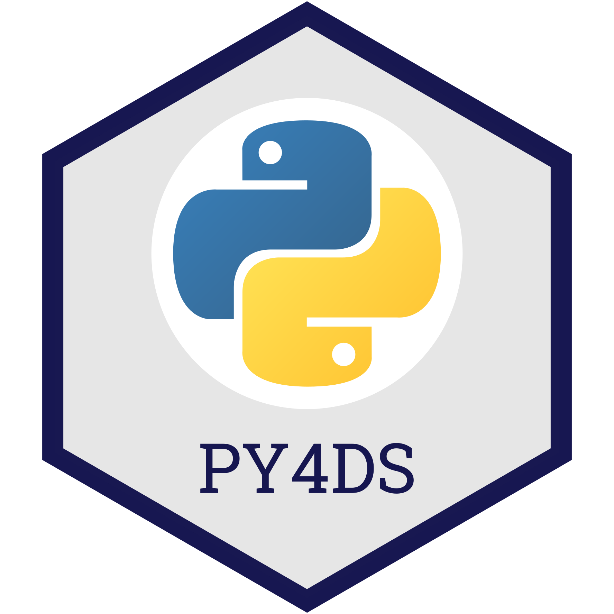

# Python Programming for Data Science

**By [Tomas Beuzen](https://www.tomasbeuzen.com/) 🚀**

Welcome to Python Programming for Data Science! With this website I aim to provide an introduction to everything you need to know to start using Python for data science. We'll cover topics such as data structures, basic programming, code testing and documentation, and using libraries like NumPy and Pandas for data exploration and analysis.

<p align="center">
  
</p>

```{admonition} Attribution
The content of this site is adapted from material I used to teach the 2020/2021 offering of the course "DSCI 511 Python Programming for Data Science" for the University of British Columbia's Master of Data Science Program. That material has built upon previous course material developed by [Patrick Walls](https://www.math.ubc.ca/~pwalls/) and [Mike Gelbart](https://www.mikegelbart.com/).
```

```{hint}
If you're interested in learning more about Python packages - check out my and [Tiffany Timber's](https://www.tiffanytimbers.com/) book [Python Packages](https://py-pkgs.org/).
```

## Key Learning Outcomes

These are the key outcomes I'd hope you would know after reading through this website:

1. Translate fundamental programming concepts such as loops, conditionals, etc into Python code.
2. Understand the key data structures in Python.
3. Understand how to write functions in Python and assess if they are correct via unit testing.
4. Know when and how to abstract code (e.g., into functions, or classes) to make it more modular and robust.
5. Produce human-readable code that incorporates best practices of programming, documentation, and coding style.
6. Use NumPy perform common data wrangling and computational tasks in Python.
7. Use Pandas to create and manipulate data structures like Series and DataFrames.
8. Wrangle different types of data in Pandas including numeric data, strings, and datetimes.

## Getting Started

I've rendered all of this material into website to make it easily accessible.

However, if you wish to run code on your local machine as you read through the notes, you should open up a terminal and do the following:

1. Clone the GitHub repository:
   ```sh
   git clone https://github.com/TomasBeuzen/python-programming-for-data-science.git
   ```
2. Install the conda environment:
   ```sh
   conda env create -f py4ds.yaml
   ```
3. Open the course in JupyterLab:
   ```sh
   jupyterlab
   ```

```{tip}
If you're not comfortable with `git`, `GitHub` or `conda`, feel free to just read through the material on this website - you're not missing out on anything! 
```
